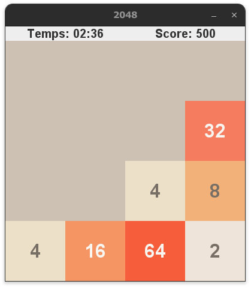

   

<h2>Objectif du jeu</h2>

Le but est de fusionner des tuiles portant des puissances de 2 pour atteindre la tuile **2048** (ou une valeur supérieure). Le joueur déplace les tuiles dans une grille **4×4** (haut, bas, gauche, droite). À chaque mouvement :
- Les tuiles glissent et fusionnent si elles ont la même valeur.
- Une nouvelle tuile (**2** ou **4**) apparaît aléatoirement dans une case vide.

<h2>Contraintes de programmation</h2>

<h4>Gestion de la grille</h4>

Représentation sous forme de matrice (tableau 2D).
Mise à jour des positions après chaque déplacement.

<h4>Fusion des tuiles</h4>

Deux tuiles identiques fusionnent en une seule (ex: `2 + 2 = 4`).
Une tuile ne peut fusionner qu'une fois par mouvement.

<h4>Génération aléatoire</h4>

Après chaque coup, une nouvelle tuile (2 ou 4) est placée dans une case vide.

<h4>Logique des déplacements</h4>

Algorithmes pour comprimer/fusionner les tuiles selon la direction (ex: déplacement vers la gauche = fusion à gauche).

<h4>Conditions de fin</h4>

<h5>Victoire</h5> 
Le joueur gagne s'il atteint la tuile maximale suivante dans le temps imparti : 

- Niveau 1 : atteindre la tuile 512 en 3 minutes
- Niveau 2 : atteindre la tuile 1024 en 4 minutes 
- Niveau 3 : atteindre la tuile 2048 en 5 minutes 

<h5>Défaite</h5> 

Le joueur perd la partie si la grille est remplie et aucun mouvement n'est possible ou le temps imparti est écoulé avant d'atteindre la tuile cible.  

<h2>Pourquoi Java ?</h2>

- Portabilité : Fonctionne sur tous les OS grâce à la JVM.  
- Orienté objet :  Structure claire pour modéliser la grille, les tuiles, etc.  
- Bibliothèques graphiques : Swing pour une interface simple.  
- Gestion des entrées Contrôles clavier faciles à implémenter.  

